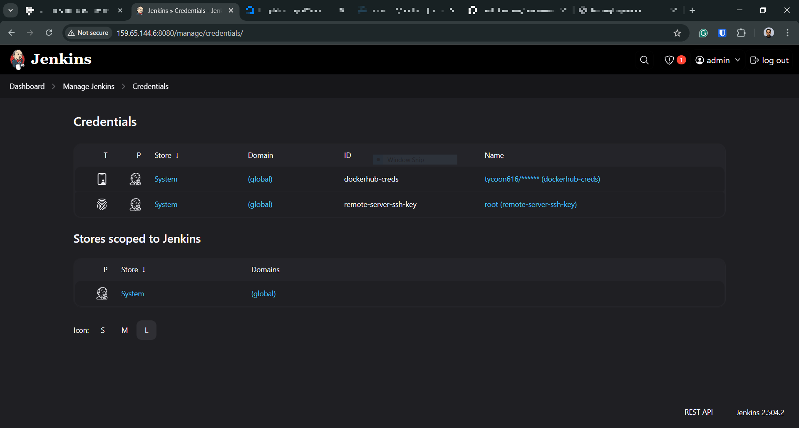
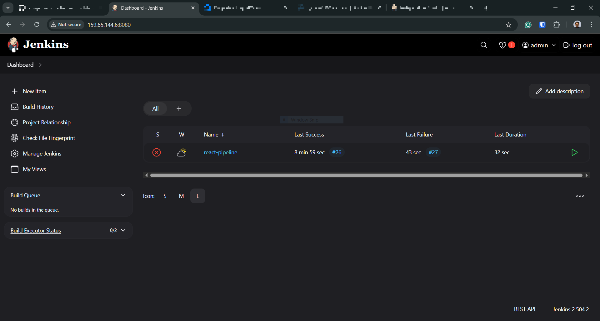
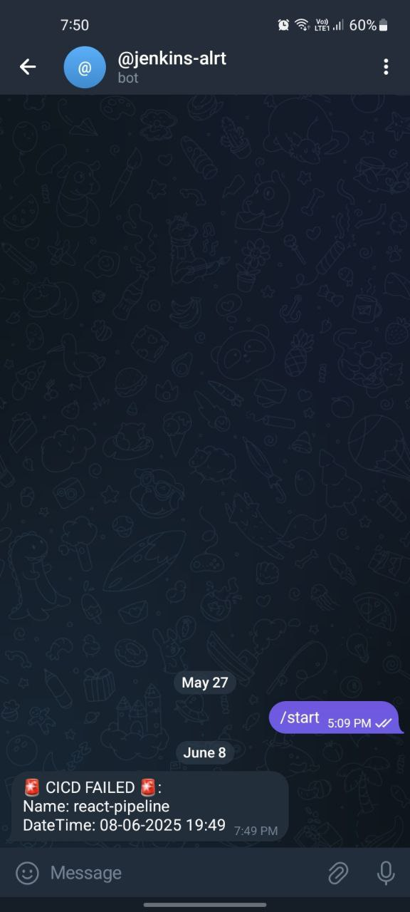

Replace these values from the pipeline code with your own values.
- `REGISTRY_URL`
- `SERVER_IP`
- `BOT_TOKEN`
- `CHAT_ID`
---

In Jenkins, you need to configure your remote server's SSH key or password to deploy your application

 

### Telegram alert when pipeline fails

